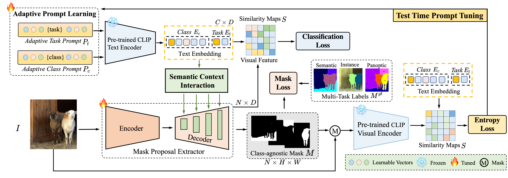

# FreeSeg: Unified, Universal and Open-Vocabulary Image Segmentation

This repository contains the pytorch codes and trained models described in the CVPR2023 paper "".  This algorithm is proposed by ByteDance, Intelligent Creation, AutoML Team (字节跳动-智能创作-AutoML团队). 

Authors: Jie Qin, Jie Wu, Pengxiang Yan, Ming Li, Ren Yuxi, Xuefeng Xiao, Yitong Wang, Rui Wang, Shilei Wen, Xin Pan, Xingang Wang

## Overview



## Installation

### Environment
* python>=3.7
* torch>=1.10.0
* torchvision>=0.11.1
* timm>=0.6.12
* detectron2>=0.6.0 follow [Detectron2 installation instructions](https://detectron2.readthedocs.io/en/latest/tutorials/install.html).
* requirement.txt

### Other dependency

The modified clip package.
```bash
cd third_party/CLIP
python -m pip install -Ue .
```

CUDA kernel for MSDeformAttn
```bash
cd mask2former/modeling/heads/ops
bash make.sh
```

## Dataset Preparation

We follow [Mask2Former](https://github.com/facebookresearch/Mask2Former/blob/main/datasets/README.md) to build some datasets used in our experiments. The datasets are assumed to exist in a directory specified by the environment variable `DETECTRON2_DATASETS`. Under this directory, detectron2 will look for datasets in the structure described below, if needed.
```bash
$DETECTRON2_DATASETS/
  ADEChallengeData2016/
  coco/
  VOC2012/
```
You need to set the location for builtin datasets by `export DETECTRON2_DATASETS=/path/to/datasets`.

###
Expected dataset structure for [COCO](https://cocodataset.org/#download):
```bash
coco/
  annotations/
    instances_{train,val}2017.json
    panoptic_{train,val}2017.json
  {train,val}2017/
    # image files that are mentioned in the corresponding json
  panoptic_{train,val}2017/  # png annotations
  stuffthingmaps/
```
Then transform the data to detecttron2 style and split it into Seen (Base) subset and Unseen (Novel) subset.
```bash
python datasets/prepare_coco_alldata.py datasets/coco

python datasets/prepare_coco_stuff_164k_sem_seg.py datasets/coco

python tools/mask_cls_collect.py datasets/coco/stuffthingmaps_detectron2/train2017_base datasets/coco/stuffthingmaps_detectron2/train2017_base_label_count.json

python tools/mask_cls_collect.py datasets/coco/stuffthingmaps_detectron2/val2017 datasets/coco/stuffthingmaps_detectron2/val2017_label_count.json
```


###
Expected dataset structure for [VOC2012](http://host.robots.ox.ac.uk/pascal/VOC/index.html):

```
VOC2012/
  JPEGImages/
  SegmentationClassAug/
  {train,val}.txt
```

Then transform the data to detecttron2 style and split it into Seen (Base) subset and Unseen (Novel) subset.
  ```bash
  python datasets/prepare_voc_sem_seg.py datasets/VOC2012

  python tools/mask_cls_collect.py datasets/VOC2012/annotations_detectron2/train_base datasets/VOC2012/annotations_detectron2/train_base_label_count.json

  python tools/mask_cls_collect.py datasets/VOC2012/annotations_detectron2/val datasets/VOC2012/annotations_detectron2/val_label_count.json
  ```

## Getting Started

### Training 
To train a model with "train_net.py", first make sure the preparations are done. 
Take the training on COCO as an example.

Training prompts
```bash
python train_net.py --config-file configs/coco-stuff-164k-156/mask2former_learn_prompt_bs32_16k.yaml --num-gpus 8
```

Training model
```bash
python train_net.py --config-file configs/coco-stuff-164k-156/mask2former_R101c_alltask_bs32_60k.yaml --num-gpus 8 MODEL.CLIP_ADAPTER.PROMPT_CHECKPOINT ${TRAINED_PROMPT_MODEL}
```


### Evaluation
```bash
python train_net.py --config-file configs/coco-stuff-164k-156/mask2former_R101c_alltask_bs32_60k.yaml --num-gpus 8 --eval-only MODEL.WEIGHTS  ${TRAINED_MODEL}
```


### Testing for Demo
The model weight for demo can get from [model](https://drive.google.com/file/d/1X0oWfcpZo5bDkyFw7xiGBk_Yqx5gxhj_/view?usp=drive_link).


## Citation

If you find this work useful in your method, you can cite the paper as below:

```bash
@inproceedings{qin2023freeseg,
  title={FreeSeg: Unified, Universal and Open-Vocabulary Image Segmentation},
  author={Qin, Jie and Wu, Jie and Yan, Pengxiang and Li, Ming and Yuxi, Ren and Xiao, Xuefeng and Wang, Yitong and Wang, Rui and Wen, Shilei and Pan, Xin and others},
  booktitle={Proceedings of the IEEE/CVF Conference on Computer Vision and Pattern Recognition},
  pages={19446--19455},
  year={2023}
}
```


